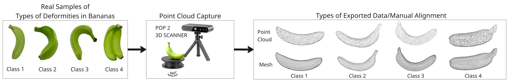
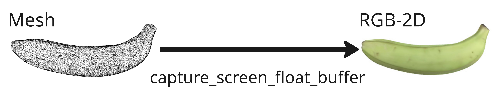
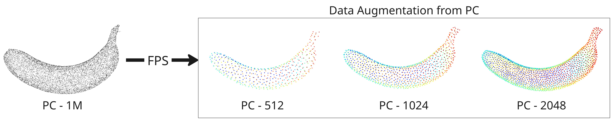

# Deformed-Banana

# 2D Dataset Banana Images
The base dataset (40 training, 5 testing, and 5 validation images per class) was augmented through 240 transformation combinations, resulting in 12,500 images.

# Synthetic Dataset Banana Images
For the PC-3D dataset, Furthest Point Sampling (FPS) was adapted to generate 250 sub-samples per original cloud across three density levels (512, 1,024, and 2,048 points), producing 12,500 sub-sampled point clouds uniformly distributed for training, testing, and validation, enabling robust comparative evaluation between domains.

First step of acquisition process


Mesh to RGB-2D rendering


FPS subsampling at different densities



For paper reference (Bibtex)

```
@inproceedings{10.1117/12.3122985,
author = {Michael B. Estrada and Luis E. Chuquimarca and Boris X. Vintimilla and Kevin E. Mu{\~n}oz and Steven S. Araujo and Sergio A. Velastin},
title = {{Deep learning for banana deformity classification: evaluating 2D and 3D domains}},
volume = {14321},
booktitle = {Seventh International Conference on Computer Vision and Information Technology (CVIT 2026)},
editor = {Jixin Ma},
organization = {International Society for Optics and Photonics},
publisher = {SPIE},
pages = {143210A},
keywords = {Banana deformity classification, Fruit quality inspection, Deep learning, 3D point clouds, 2D RGB images},
year = {2026},
doi = {10.1117/12.3122985},
URL = {https://doi.org/10.1117/12.3122985}
}
```

